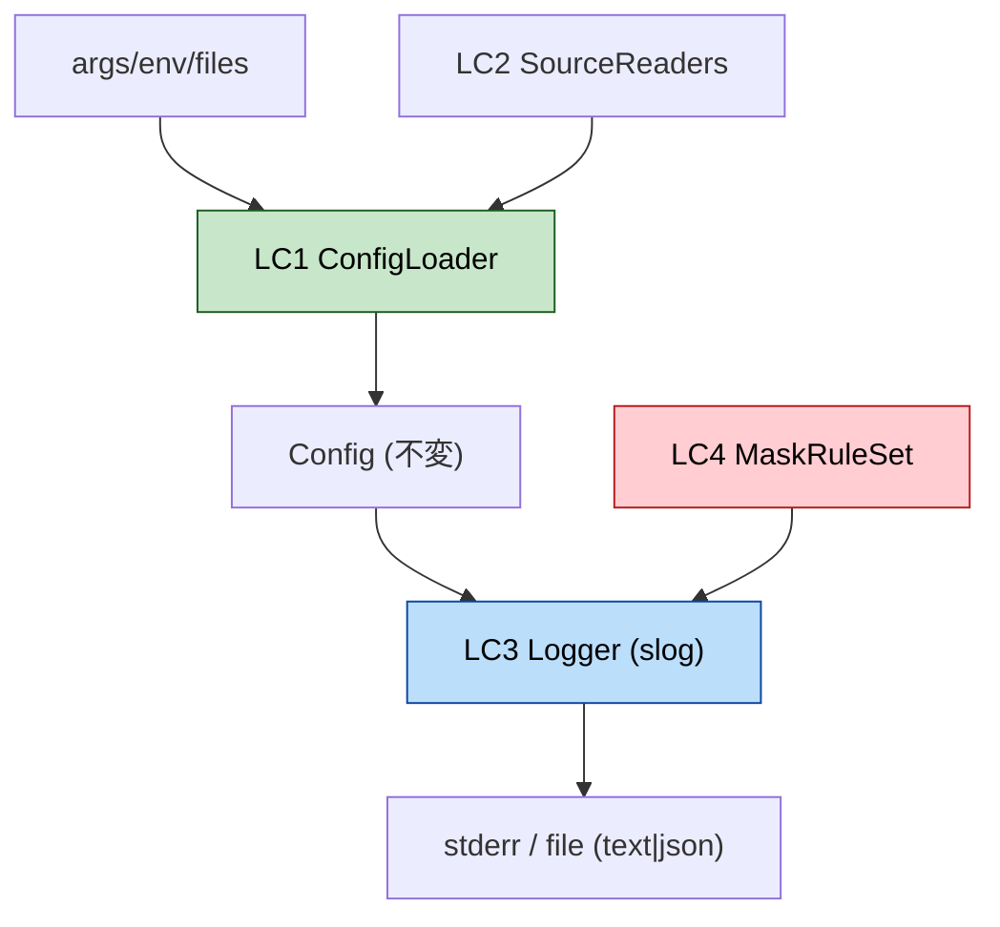

# Logical Components — U1 Foundation

> NFRを担う論理コンポーネント。U1はインフラ部品（queue/cache/circuit breaker/load balancer 等）を**持たない**。プロセス内の論理部品のみ。

## LC1. ConfigLoader
- **責務**: ソース収集（default/home/project/env/flag）→ 段階的上書きマージ(P3) → 検証集約(P2) → 不変Config返却。
- **入出力**: in: args/env/ファイル群、out: `Config` または 集約error。
- **パターン**: P3（マージ）, P2（検証集約）, P4（フェイルクローズ）。

## LC2. ConfigSourceReaders（補助）
- **責務**: 各ソースを部分設定へ読む小コンポーネント群: `defaultsProvider`, `yamlFileReader`(home/project), `envReader`(SHIROUTO_*), `flagReader`。
- **備考**: それぞれ「未設定」を表現でき、由来(ConfigSource)を付与。テスト時に個別モック可能。

## LC3. Logger（slogベース）
- **責務**: 構造化ログの生成・出力。`maskingHandler`(P1) → 基底Handler(JSON/text) → 出力先(stderr/file)。
- **構成**: `LogLevel`/`LogFormat`/`LogFile`（Config由来）でビルド。`With(correlationID)`で派生。
- **パターン**: P1（マスキングデコレータ）, P4（fileフォールバック）, P5（遅延評価）。

## LC4. MaskRuleSet
- **責務**: マスク規則の集合（キー名一致・プロンプト本文・値パターン）。Loggerが保持しP1で適用。
- **拡張余地**: 規則はデータ駆動（将来 Config から追加可能にできる）。MVPは固定セット。

## コンポーネント関係

## テスト容易性（NFR-M1）
- LC2 はインタフェースで注入 → LC1 を実ファイルなしでテスト可能。
- LC3 は `io.Writer` を注入 → 出力をバッファに取りアサート。マスクはPBTで検証。
