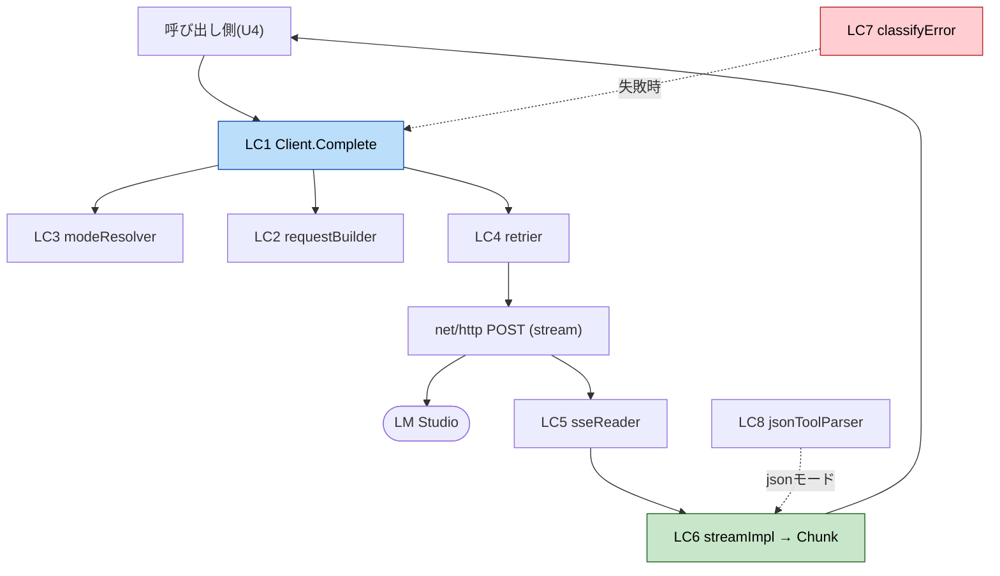

# Logical Components — U2 LLM Connectivity

> プロセス内の論理部品。外部インフラ部品（queue/cache/circuit breaker）は持たない。

## LC1. Client
- **責務**: `Complete(ctx, Request) (Stream, error)` の入口。設定(baseURL/timeouts/retry)・httpClient・logger を保持。モード解決→ペイロード組立→送信→ストリーム返却を統括。
- **依存**: U1 Config（endpoint/model/timeouts）, U1 Logger。

## LC2. requestBuilder
- **責務**: `Request`＋モード→ OpenAI互換 JSONペイロード。functionモードのみ `tools` を含め、jsonモードは system にJSON出力規約を付与。temperature/max_tokens は非nilのみ。

## LC3. modeResolver（P5）
- **責務**: `Caps`＋`ToolMode`→ 実行モード決定。autoフォールバックの1回制御とCapsキャッシュ。

## LC4. retrier（P2）
- **責務**: ヘッダ確立までの送信を指数バックオフでリトライ。retryable判定・ctx中断・ストリーム開始後の非リトライ。

## LC5. sseReader（P3）
- **責務**: `bufio.Scanner` で SSE を行読みし `event` を1件ずつ返す。コメント/空行無視、`data:`連結、`[DONE]`検出。

## LC6. streamImpl（P3, Stream実装）
- **責務**: `sseReader` の event をドメイン `Chunk`（TextDelta/ToolCallDelta/Done）へ変換。tool_call断片の index 連結。アイドルタイマ管理（P1）。`Recv()/Close()`。

## LC7. classifyError（P4）
- **責務**: net/HTTP/SSE/JSON の失敗を `LLMError`（Kind/UserMessage/Retryable/wrapped）へ単一集約。

## LC8. jsonToolParser（Functional R3）
- **責務**: jsonモードの最終テキストから単一JSON（`{"tool",...}` or `{"final",...}`）を抽出・正規化。不能なら Decode エラー。

## 関係

## テスト容易性（NFR-M1）
- LC1 は `baseURL`/`httpClient`/`logger` 注入可 → `httptest.Server` で全経路をモック。
- LC5/LC6/LC7/LC8 は純粋寄りで個別ユニット/PBT可能（SSE保存則・tool_call結合・エラー分類・JSON往復）。
