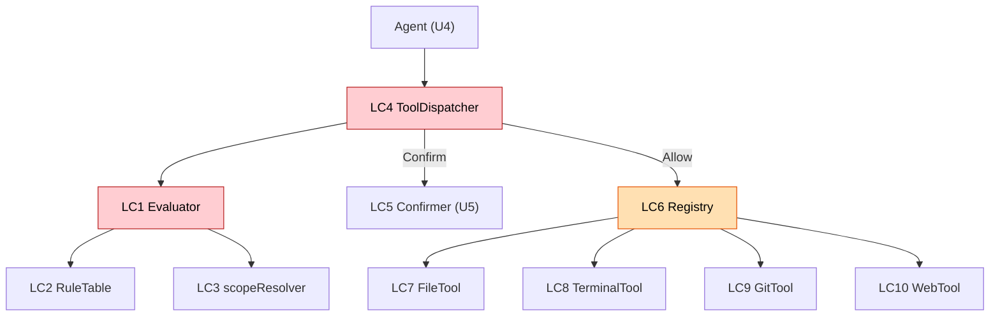

# Logical Components — U3 Tools & Guardrail

> プロセス内論理部品。外部インフラ部品なし。

## ガードレール（`internal/guardrail`）
### LC1. Evaluator
- **責務**: `Evaluate(Action) (Decision, reason)`。スコープ検査(P1) + ルール表(P2) + フェイルクローズ既定。Config ポリシー（WorkspaceRoot/ExtraDenyPatterns）を保持。

### LC2. RuleTable
- **責務**: `defaultRules()` データ表（Command/Git/Web/File 種別の Deny/Confirm 規則）。正規化マッチ。Config パターンをマージ。

### LC3. scopeResolver
- **責務**: `resolveWithin(root, target)`（P1, EvalSymlinks＋親解決）。File/Git パスの内外判定。

### LC4. ToolDispatcher（単一窓口）
- **責務**: `Dispatch(ctx, ToolCall)`（P5）。Registry/Evaluator/Confirmer/Logger を統合。唯一の実行口。

### LC5. Confirmer（境界）
- **責務**: `Confirm(ctx, Action, reason) (bool, error)`。U5実装。非対話フェイク/実装は Deny相当。

## ツール（`internal/tools`）
### LC6. Registry
- **責務**: Tool 登録・取得・`Specs()`（U2へ提示）。

### LC7. FileTool
- **責務**: read / write(create|overwrite|edit|delete)。原子的書込(P4)・一意置換。

### LC8. TerminalTool
- **責務**: `os/exec` 実行（P3, プロセスグループkill・タイムアウト・出力ストリーム上限）。

### LC9. GitTool
- **責務**: `git` CLI を `os/exec`。op/args をそのまま（判定はガードレール側）。

### LC10. WebTool
- **責務**: `net/http` GET。http(s)のみ・サイズ上限・リダイレクト制限。

## 関係

## テスト容易性（NFR-M1）
- LC1/LC2/LC3 は純粋寄り → PBT（スコープ・denylist・実行可否）。
- LC4 は Confirmer/Registry をフェイク注入してディスパッチ分岐をテスト。
- LC7-LC10 は `t.TempDir()`/`echo`/`httptest` で副作用を hermetic に検証。
