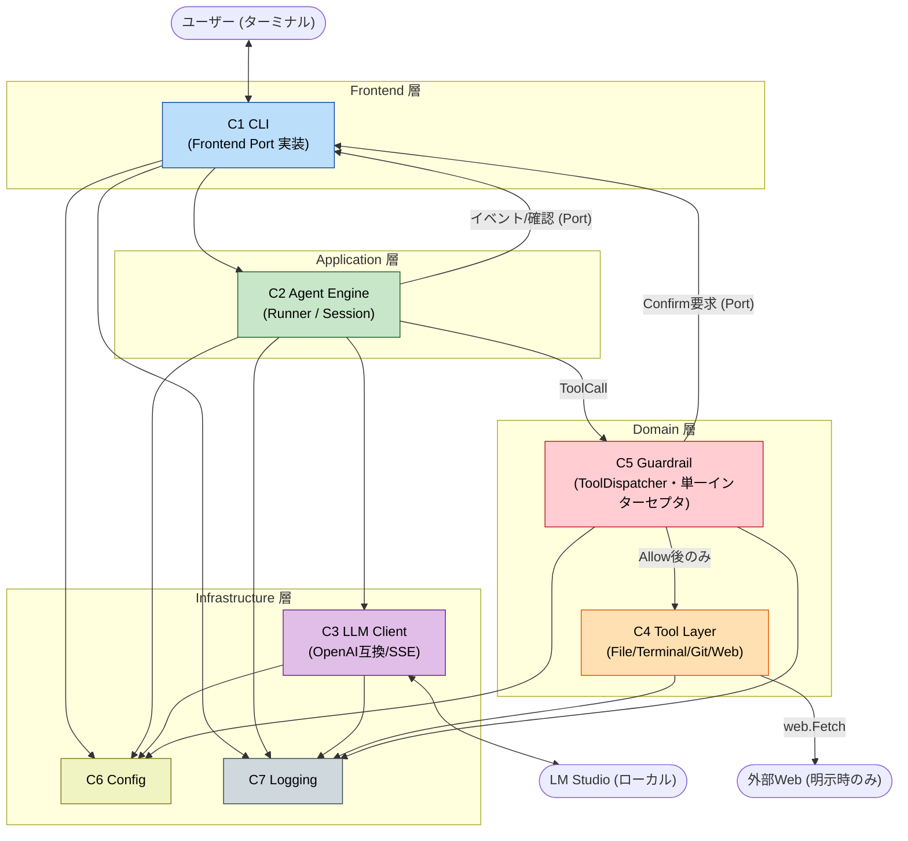

# Component Dependency — ShiroutoCode (Application Design)

## 依存マトリクス（行が列に依存）
| ↓依存元 / 依存先→ | C1 CLI | C2 Agent | C3 LLM | C4 Tools | C5 Guardrail | C6 Config | C7 Log |
|---|---|---|---|---|---|---|---|
| **C1 CLI** | — | ✔ | | | | ✔ | ✔ |
| **C2 Agent** | ✔(Port) | — | ✔ | (経由C5) | ✔ | ✔ | ✔ |
| **C3 LLM** | | | — | | | ✔ | ✔ |
| **C4 Tools** | | | | — | | | ✔ |
| **C5 Guardrail** | ✔(Port,確認) | | | ✔ | — | ✔ | ✔ |
| **C6 Config** | | | | | | — | ✔ |
| **C7 Log** | | | | | | | — |

- C2→C1 は具体ではなく **Frontend Port インタフェース**への依存（DIで注入）。循環ではない（境界はインタフェース）。
- C2 は C4 を**直接呼ばない**。必ず C5(ToolDispatcher) 経由（Q5=A・バイパス不可）。
- C7(Log) は最下層、他に依存しない。

## 通信パターン
- **すべてプロセス内**の関数呼び出し（完全ローカル, NFR-2）。ネットワークは C3→LM Studio(HTTP/SSE) と C4.web→外部HTTP のみ。
- **イベント送出**: C2→C1 は Frontend Port のコールバック（ストリーミング表示・進行・確認）。
- **キャンセル伝播**: `context.Context` を全層に貫通（Ctrl-C → cancel, US-1.3/NFR-3）。
- **将来のVSCodeフロント**: C1 を IPC アダプタ（stdio JSON-RPC等）に差し替え、同じ Frontend Port を実装（A3、今回未実装）。

## データフロー（Mermaid）

## 安全性に関わる構造的不変条件
1. **ツール実行の単一窓口**: C4 へのアクセスは C5(ToolDispatcher) のみ（Q5=A）。
2. **フェイルクローズ**: C5 の判定不能/エラーは Allow にならない（SECURITY-15）。
3. **スコープ限定**: ファイル操作は C6 のワークスペースルート配下のみ。逸脱は C5 がブロック（US-5.3）。
4. **機微情報非漏洩**: C7 がマスキング、C3 のエラーは一般化（SECURITY-03/09）。
