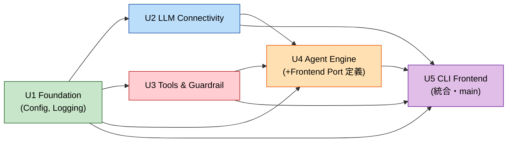

# Unit of Work Dependency — ShiroutoCode

## 依存マトリクス（行が列に依存）
| ↓依存元 / 依存先→ | U1 Foundation | U2 LLM | U3 Tools&Guardrail | U4 Agent | U5 CLI |
|---|---|---|---|---|---|
| **U1 Foundation** | — | | | | |
| **U2 LLM** | ✔ | — | | | |
| **U3 Tools&Guardrail** | ✔ | | — | | |
| **U4 Agent** | ✔ | ✔ | ✔ | — | ◑(Port定義) |
| **U5 CLI** | ✔ | ✔ | ✔ | ✔ | — |

- ◑: U4 は `Frontend` Port を**インタフェースとして定義**し依存。具象実装は U5。実装順では U4 がモックで先行可能（循環ではない）。
- U1 は他に依存しない土台。U5 は全unitの統合点。

## 依存グラフ（Mermaid）

## 実装順序（Critical Path）
**U1 → U2 → U3 → U4 → U5**（Q2=A）
- U2 と U3 は U1 完了後それぞれ着手可能（相互依存なし。逐次実装だが論理的には並行可能）。
- U4 は U2・U3 の完了に依存。
- U5 は全unit完了後の統合 + E2E 確認（Q3=A）。

## 結合・テスト戦略（Q3=A）
- 各 unit: 依存はインタフェースでモック注入し、**単体テスト + PBT green** で完了。
- E2E（実 LM Studio 接続〜マルチファイル編集）は **U5 完成時** にまとめて確認。
- 統合テストは Build and Test ステージで横断的に実施。
