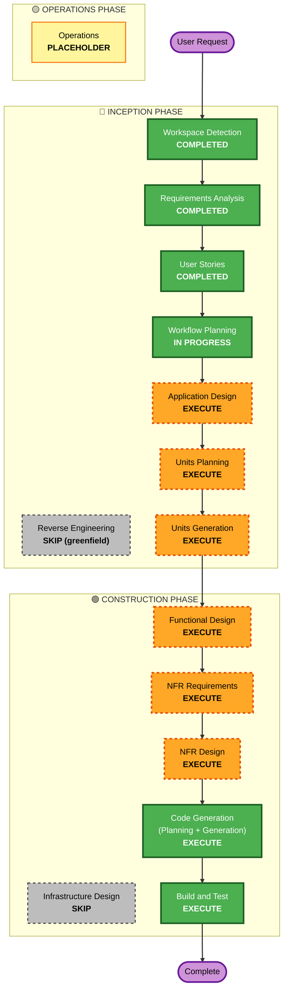

# Execution Plan — ShiroutoCode

> **改定履歴**: 2026-06-08 アーキテクチャ転換 — Go製ヘッドレスコア + 対話型CLI（CLI-first）。VSCode拡張フロントは後続フェーズ。PBTフレームワーク fast-check → **rapid（Go）**。旧版は `execution-plan.md.backup.20260608T000000Z`。

## Detailed Analysis Summary

### Transformation Scope
- **Project Type**: Greenfield（ゼロからの新規開発）→ Brownfield固有の分析（変換スコープ/コンポーネント関係/モジュール調整）は **N/A**。
- **Primary Changes**: **Go製のヘッドレスエンジン + 対話型CLI** を新規構築。CLI UI ＋自律エージェントループ（plan→act→observe）＋LM Studio（OpenAI互換REST/SSE）連携＋ツール実行層（File/Terminal/Git/Web）＋セーフティガードレール。単一静的バイナリ配布。VSCode拡張フロントは**今回スコープ外**（コアをフロント非依存に設計）。
- **Related Components**: CLIフロント、エージェントエンジン、LLMクライアント、ツール群、ガードレール、設定、ログ基盤。

### Change Impact Assessment
- **User-facing changes**: Yes — 対話型CLI（指示入力、思考/アクション可視化、中断操作、エラーUX、危険操作の確認プロンプト）。
- **Structural changes**: Yes — システム全体を新規にアーキテクチャ設計（多コンポーネント、フロント非依存コア）。
- **Data model changes**: Yes（新規）— 会話/メッセージ、ツール呼び出し、エージェント状態、設定スキーマ。永続DBは持たない（ローカルのみ）。
- **API changes**: Yes（外部依存）— LM Studio OpenAI互換 `/v1/chat/completions`（SSEストリーミング）への変換層。
- **NFR impact**: Yes — 性能（ストリーミング/goroutine+contextによる非ブロッキング・中断）、セキュリティ（ガードレール=中核）、信頼性（フェイルクローズ）、可観測性、テスト容易性（PBT=rapid）。

### Risk Assessment
- **Risk Level**: High — 自律エージェントがファイル編集・コマンド実行・Git・Webを**自動承認**で行うため、ガードレールの正しさが安全性の要。複数コンポーネントの協調も必要。
- **Rollback Complexity**: Easy（開発時）— グリーンフィールドのためコード/ドキュメントの巻き戻しは容易。ただし実行時のワークスペース変更は破壊的になりうる（→ガードレールとフェイルクローズで緩和）。
- **Testing Complexity**: Complex — エージェントループ、ガードレール判定、API変換層は単体＋プロパティベーステスト（fast-check）対象。

## Workflow Visualization

## Phases to Execute

### 🔵 INCEPTION PHASE
- [x] Workspace Detection (COMPLETED)
- [x] Reverse Engineering (SKIPPED)
  - **Rationale**: グリーンフィールド。既存コードなし。
- [x] Requirements Analysis (COMPLETED)
- [x] User Stories (COMPLETED)
- [x] Execution Plan (IN PROGRESS)
- [ ] Application Design — **EXECUTE**
  - **Rationale**: 新規システムであり、複数の新規コンポーネント（Webview UI、エージェントエンジン、LLMクライアント、各ツール、ガードレール、設定）の責務・メソッド・依存関係・ビジネスルールの定義が必要。
- [ ] Units Planning — **EXECUTE**
  - **Rationale**: システム全体規模で関心事が明確に分かれる（UI / エージェント中核 / LLM連携 / ツール / ガードレール）。構造的に作業単位へ分解することで設計・実装・テストを安全に進められる。
- [ ] Units Generation — **EXECUTE**
  - **Rationale**: 上記の分解を具体的な units of work として確定し、Construction を unit 単位で回す。

### 🟢 CONSTRUCTION PHASE（各 unit ごとにループ）
- [ ] Functional Design — **EXECUTE**
  - **Rationale**: エージェントループ（plan→act→observe / 終了条件）、ガードレール判定ロジック、OpenAI互換API変換・SSE処理など、複雑なビジネスロジックとデータモデルの詳細設計が必要。
- [ ] NFR Requirements — **EXECUTE**
  - **Rationale**: 性能（ストリーミング/UI非ブロッキング）、セキュリティ（ガードレール=中核、Security Baseline拡張がBlocking）、信頼性（フェイルクローズ）、可観測性、テスト容易性（PBT拡張がBlocking）の要件確定が必要。技術スタックはTypeScriptで確定済みだがNFR観点は残る。
- [ ] NFR Design — **EXECUTE**
  - **Rationale**: NFR Requirementsを実装パターン（非同期/キャンセル、構造化ログ、機微情報マスキング、フェイルクローズ、PBT戦略）へ落とし込む。
- [ ] Infrastructure Design — **SKIP**
  - **Rationale**: クラウド/サーバ/データストアを持たない完全ローカルのCLIツール（NFR-2）。デプロイ対象インフラなし。配布（クロスコンパイル / 単一バイナリ / GitHub Releases / `go install`）はBuild and Testおよび将来のOperationsで扱う。
- [ ] Code Generation — **EXECUTE (ALWAYS)**
  - **Rationale**: 実装計画と実コード（拡張本体・UI・エージェント・ツール・ガードレール・テスト）の生成が必要。
- [ ] Build and Test — **EXECUTE (ALWAYS)**
  - **Rationale**: ビルド（`go build` / クロスコンパイル）、単体テスト（`go test`）、プロパティベーステスト（rapid）、統合テスト、`govulncheck`、単一バイナリ配布の検証が必要。

### 🟡 OPERATIONS PHASE
- [ ] Operations — **PLACEHOLDER**
  - **Rationale**: 将来のデプロイ/監視ワークフロー用プレースホルダ。Marketplace公開の運用はここで将来扱う。

## Extension Enforcement（有効化済み拡張の適用方針）
| Extension | Enabled | 適用方針 |
|---|---|---|
| Security Baseline | Yes (Blocking) | 各ステージで関連ルールを評価。特にガードレール（SECURITY-11）、入力検証（SECURITY-05）、フェイルセーフ（SECURITY-15）、サプライチェーン（SECURITY-10）、ハードニング（SECURITY-09）、完全性（SECURITY-13）。クラウド/認証前提のルールはN/A判定（根拠を各ステージで明記）。 |
| Property-Based Testing | Yes (Blocking) | **Go → rapid（PBT-09）**。エージェントループ・ガードレール判定・API変換層・パス正規化など純粋ロジックにPBTを適用。Functional/NFR Design および Code Generation で具体化。 |

## Package / Unit Change Sequence
グリーンフィールドのため厳密な依存順は Units Generation で確定するが、想定される論理的順序：
1. **設定 & ログ基盤**（config 読み込み、構造化ログ、機微情報マスキング）— 他全unitの土台
2. **LLMクライアント**（OpenAI互換REST / SSEストリーミング、エラーハンドリング）
3. **ツール層**（File / Terminal / Git / Web）+ **ガードレール**（横断的安全制御、単一インターセプタ）
4. **エージェントエンジン**（plan→act→observe、終了条件、中断、context伝播）— 上記を統合
5. **対話型CLI**（指示入力・履歴・逐次可視化・中断(Ctrl-C)・危険操作確認・エラーUX）— ユーザー接点
   - 注: コアはフロント非依存。将来のVSCode拡張フロントはIPC経由の別プロセスとして同コアに接続（今回未実装）。

## Estimated Timeline
- **Total Stages to Execute (残り)**: INCEPTION 3（Application Design / Units Planning / Units Generation）+ CONSTRUCTION 各unit×（Functional / NFR Req / NFR Design / Code Gen）+ Build and Test。
- **Estimated Duration**: 反復的（unit数に依存）。Units Generation で units 数が確定後に精緻化。

## Success Criteria
- **Primary Goal**: 自然言語の指示一つで、ローカルLLM（LM Studio）を用いて複数ファイルにまたがる変更を**安全に自動完遂**できる **Go製CLI** のMVP（US-3.1）。
- **Key Deliverables**:
  - 対話型CLI（履歴/思考/アクション可視化、中断、危険操作確認）
  - LM Studio連携（設定可能エンドポイント、SSEストリーミング）
  - 自律エージェントループ（終了条件・最大ステップ）
  - ツール群（File/Terminal/Git/Web）
  - セーフティガードレール（専用パッケージ、フェイルクローズ）
  - 単体テスト + プロパティベーステスト（rapid）
  - 単一静的バイナリ（クロスプラットフォーム配布）
- **Quality Gates**:
  - Security Baseline（Blocking）適用ルールに非準拠がないこと
  - PBT（Blocking）が対象ロジックに適用されていること
  - フェイルクローズ／ワークスペーススコープ限定が検証可能なこと
